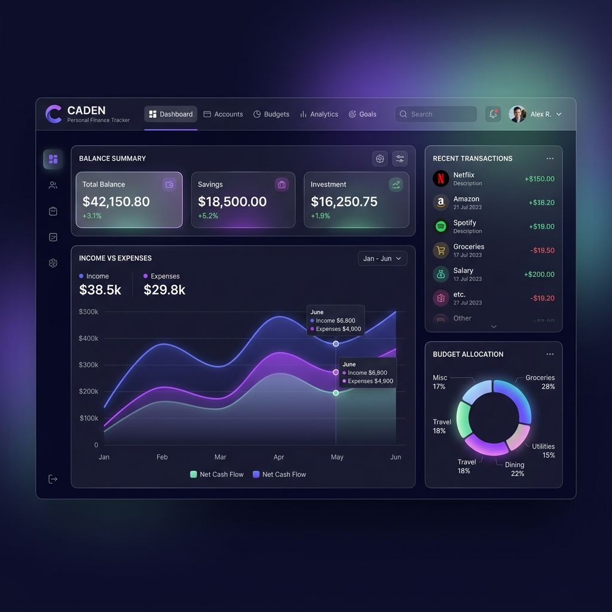
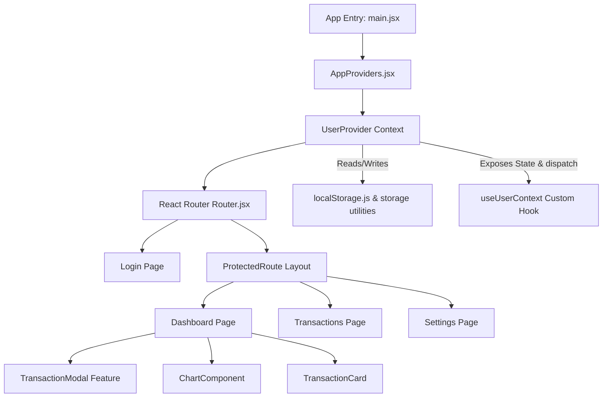

# 🪙 Caden — Personal Finance Tracker

<div align="center">

[](https://react.dev/)
[](https://vite.dev/)
[](https://tailwindcss.com/)
[](https://eslint.org/)
[](https://prettier.io/)
[](LICENSE)

**A sleek, responsive, and intuitive dashboard designed for personal transaction logging and financial analytics.**

[Key Features](#-key-features) • [Architecture](#-architecture) • [File Structure](#-file-structure) • [Tech Stack](#-tech-stack) • [Installation](#-installation--setup) • [Future Enhancements](#-future-enhancements)

</div>

---

## 🖼️ Preview

<div align="center">
  
  <p><em>Premium glassmorphic dashboard mockup of the Caden platform</em></p>
</div>

---

## ✨ Key Features

- **🔐 Mock Authentication & Session Management**: Simplistic login setup which securely maps transactions to custom user profiles.
- **📊 Real-time Financial Dashboard**:
  - **Dynamic Metrics**: Instant calculations of Net Balance, Total Monthly Income, and Total Monthly Expenses.
  - **Data Visualization**: An interactive bar chart tracking monthly patterns and income-to-expense ratios (powered by Chart.js).
  - **Recent Activity**: Quick snapshot of the latest 5 transactions.
- **📝 Ledger / Transactions Explorer**: Complete, filterable view of all logs with pagination & search hooks already prepared.
- **💸 Transaction Modal**: Custom modal workflow to input details like transaction type (Income/Expense), date, amount, category, and remarks.
- **⚙️ Preferences & Data Management**:
  - Customize display currencies and toggle aesthetic styling themes.
  - Complete control over data with export capabilities and the ability to wipe localized profiles.
- **💾 Local Storage Persistence**: State synchronization with browser `localStorage` ensuring sessions remain uninterrupted.

---

## 📐 Architecture

The application uses **React Context API** coupled with a centralized **Reducer** to coordinate changes between UI components, custom hooks, and the local storage synchronization engine.



---

## 📂 File Structure

```hl
Caden/
├── public/                 # Static assets and public resources
└── src/
    ├── app/                # Application Core Configuration
    │   ├── context/        # React Context API Configurations
    │   │   ├── UserContext.js
    │   │   └── reducers/   # Redux-like Action Reducers
    │   │       └── userReducer.js
    │   ├── hooks/          # Custom Application Hooks
    │   │   └── useUserContext.js
    │   └── providers.jsx   # Bundled state & router providers
    ├── assets/             # Images, SVGs, and brand assets
    ├── components/         # Shared Reusable Components
    │   ├── Layout/         # Structure templates (Sidebar, ProtectedRoute)
    │   └── ui/             # Atomic design components (Buttons, Inputs, Cards)
    ├── features/           # Modularized Business Domain Logic
    │   ├── TransactionModal/ # Add/Edit transaction window components
    │   └── auth/           # Login & session authentication components
    ├── lib/                # Shared Utilities and Third-Party Clients
    │   ├── localStorage.js # Web storage wrapper
    │   └── utils.js        # Helper formatting & UI functions
    ├── pages/              # Application Top-Level Page Views
    │   ├── Dashboard.jsx
    │   ├── Login.jsx
    │   ├── Settings.jsx
    │   └── Transactions.jsx
    ├── index.css           # Global stylesheets & Tailwind directives
    ├── main.jsx            # DOM Entry node mount
    └── router.jsx          # React Router v7 layout rules
```

---

## 🛠️ Tech Stack

| Technology                     | Purpose                                      | Documentation                               |
| :----------------------------- | :------------------------------------------- | :------------------------------------------ |
| **React 19**                   | Modern reactive component framework          | [react.dev](https://react.dev/)             |
| **Vite 8**                     | Rapid front-end build and bundling tool      | [vite.dev](https://vite.dev/)               |
| **Tailwind CSS v4**            | Clean utility-first styling architecture     | [tailwindcss.com](https://tailwindcss.com/) |
| **React Router v7**            | Fluid application state navigation & routing | [reactrouter.com](https://reactrouter.com/) |
| **Chart.js & react-chartjs-2** | Modern interactive database visualizations   | [chartjs.org](https://www.chartjs.org/)     |
| **Lucide React**               | Consistent, premium minimalist iconography   | [lucide.dev](https://lucide.dev/)           |

---

## 🚀 Installation & Setup

Make sure you have [Node.js](https://nodejs.org/) installed. This project uses **pnpm** for package management.

### 1. Clone & Navigate

```bash
git clone https://github.com/your-username/caden.git
cd Caden
```

### 2. Install Dependencies

```bash
pnpm install
```

### 3. Start Development Server

```bash
pnpm run dev
```

The application will launch locally at `http://localhost:5173`.

### 4. Build for Production

To bundle the project for optimized static hosting:

```bash
pnpm run build
```

---

## 📄 License

This project is licensed under the MIT License - see the [LICENSE](LICENSE) file for details.
