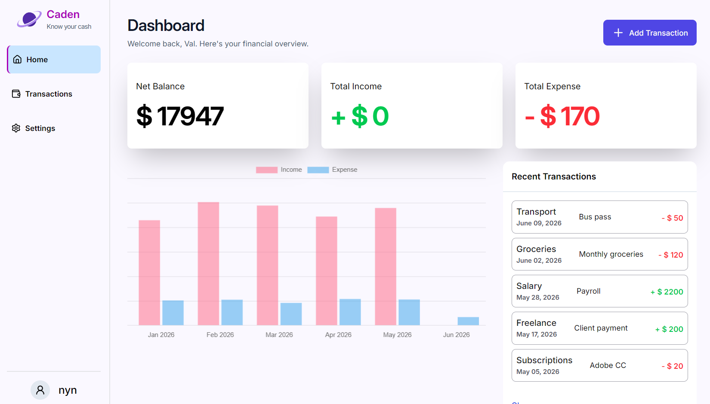
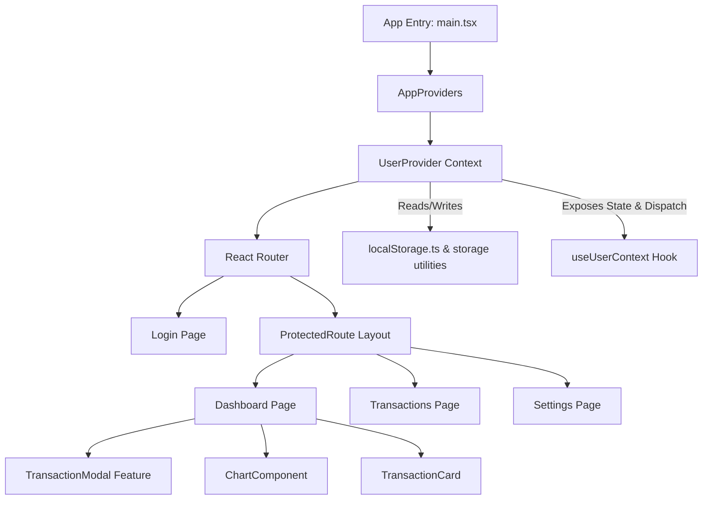

# 🪙 Caden — Personal Finance Tracker

<div align="center">

[](https://react.dev/)
[](https://www.typescriptlang.org/)
[](https://vite.dev/)
[](https://tailwindcss.com/)
[](https://eslint.org/)
[](LICENSE)

**A sleek, type-safe, and incredibly intuitive dashboard designed for personal transaction logging and financial analytics.**

[Key Features](#-key-features) • [Architecture](#-architecture) • [File Structure](#-file-structure) • [Tech Stack](#-tech-stack) • [Installation](#-installation--setup) • [Future Enhancements](#-future-enhancements)

</div>

---

## 🖼️ Preview

<div align="center">
  
  <p><em>Premium glassmorphic dashboard mockup of the Caden platform</em></p>
</div>

---

## ✨ Key Features

- **🔐 Mock Authentication & Session Management**: Simplistic login setup which securely maps transactions to custom user profiles.
- **📊 Real-time Financial Dashboard**:
  - **Dynamic Metrics**: Instant calculations of Net Balance, Total Monthly Income, and Total Monthly Expenses.
  - **Data Visualization**: An interactive bar chart tracking monthly patterns and income-to-expense ratios (powered by Chart.js).
  - **Recent Activity**: Quick snapshot of the latest 5 transactions.
- **📝 Ledger / Transactions Explorer**: Complete, filterable view of all logs with pagination & search hooks built-in.
- **💸 Transaction Modal**: Custom modal workflow to input details like transaction type (Income/Expense), date, amount, category, and remarks.
- **⚙️ Preferences & Data Management**:
  - Customize display currencies and toggle aesthetic styling themes.
  - Complete control over data with export capabilities and the ability to wipe localized profiles.
- **🛡️ 100% Type-Safe**: Fully rewritten in **TypeScript** for robust state management, precise typing, and developer sanity!
- **💾 Local Storage Persistence**: State synchronization with browser `localStorage` ensuring sessions remain uninterrupted.

---

## 📐 Architecture

Caden relies on a robust **React Context API** coupled with a centralized **Reducer** to coordinate changes between UI components, custom hooks, and the local storage synchronization engine. The integration of TypeScript ensures payload integrity across all dispatch actions.


```mermaid
graph TD
    A[App Entry: main.tsx] --> B[AppProviders]
    B --> C[UserProvider Context]
    C --> D[React Router]
    D --> E[Login Page]
    D --> F[ProtectedRoute Layout]
    F --> G[Dashboard Page]
    F --> H[Transactions Page]
    F --> I[Settings Page]

    G --> J[TransactionModal Feature]
    G --> K[ChartComponent]
    G --> L[TransactionCard]

    C -->|Reads/Writes| M[localStorage.ts & storage utilities]
    C -->|Exposes State & Dispatch| N[useUserContext Hook]
```

---

## 📂 File Structure

Caden is meticulously organized using a feature-first architectural pattern. This scalable structure isolates domains while keeping shared logic centralized.

```text
Caden/
├── public/                 # Static assets and public resources
└── src/
    ├── app/                # Application Core Configuration
    │   ├── context/        # React Context & Context Types
    │   ├── hooks/          # Custom Application Hooks (useUserContext.ts)
    │   ├── Providers/      # Global Providers (UserProvider.tsx)
    │   ├── reducers/       # Redux-like Action Reducers (userReducer.ts)
    │   ├── routes/         # Route Guarding (ProtectedRoute.tsx)
    │   └── router.tsx      # React Router Navigation Logic
    ├── assets/             # Images, SVGs, and brand assets
    ├── components/         # Shared Reusable Components
    │   ├── Layout/         # Structure templates (AppLayout, Sidebar)
    │   └── UI/             # Atomic design components (Buttons, Inputs, Graphs)
    ├── constants/          # Enums and App-wide Constants (currency.ts)
    ├── features/           # Modularized Business Domain Logic
    │   ├── auth/           # Login & session components
    │   ├── TransactionCard/# Transaction history elements
    │   └── TransactionModal/# Add/Edit transaction flows
    ├── lib/                # Shared Utilities & Helpers (utils.ts, dateTime.ts)
    ├── pages/              # Top-Level Page Views (Dashboard, Settings, etc.)
    ├── index.css           # Global stylesheets & Tailwind directives
    ├── App.tsx             # Main App Component Wrapper
    └── main.tsx            # DOM Entry Node Mount
```

---

## 🛠️ Tech Stack

| Technology                                        | Purpose                                        |
| :------------------------------------------------ | :--------------------------------------------- |
| **[React 19](https://react.dev/)**                | Modern reactive component framework            |
| **[TypeScript](https://www.typescriptlang.org/)** | Static typing for robust code reliability      |
| **[Vite 8](https://vite.dev/)**                   | Lightning-fast front-end build & bundling tool |
| **[Tailwind CSS v4](https://tailwindcss.com/)**   | Clean, utility-first styling architecture      |
| **[React Router v7](https://reactrouter.com/)**   | Fluid application state navigation & routing   |
| **[Chart.js](https://www.chartjs.org/)**          | Modern interactive database visualizations     |
| **[Lucide React](https://lucide.dev/)**           | Consistent, premium minimalist iconography     |

---

## 🚀 Installation & Setup

Make sure you have [Node.js](https://nodejs.org/) installed. This project uses **pnpm** for rapid package management.

### 1. Clone & Navigate

```bash
git clone https://github.com/nyniraula/caden.git
cd Caden
```

### 2. Install Dependencies

```bash
pnpm install
```

### 3. Start Development Server

```bash
pnpm run dev
```

_The application will launch locally at `http://localhost:5173`._

### 4. Build for Production

To bundle the project for optimized static hosting (with full type-checking):

```bash
pnpm run build
```

---

## 🤝 Contributing

Want to make Caden even better? Contributions are always welcome! Feel free to open an issue or submit a Pull Request.

## 📄 License

This project is licensed under the MIT License - see the [LICENSE](LICENSE) file for details.

<div align="center">
  <b>Built with ❤️ by an awesome developer.</b>
</div>
